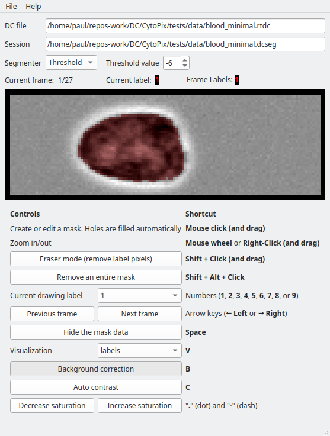

Welcome to CytoPix's documentation!
======================================

Missing something? Please create an
`issue <https://github.com/DC-analysis/CytoPix/issues>`_.

    The main window of CytoPix for manual segmentaion.

.. toctree::
   :maxdepth: 2
   :caption: Contents:

Indices and tables
==================

* :ref:`genindex`
* :ref:`modindex`
* :ref:`search`
